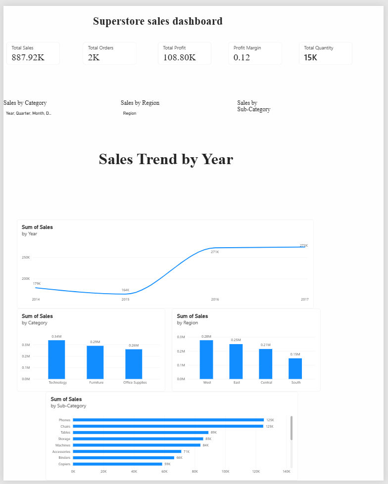

# 📊 Superstore Sales Dashboard

### EncoderX Remote Internship — Data Science | Week 04

## 📌 Project Overview

This project presents an **interactive business dashboard** built with **Microsoft Power BI** to explore sales performance in the Superstore dataset.

The report brings key performance indicators (KPIs), yearly sales, and category, regional, and sub-category comparisons together. Date, region, and category slicers let viewers explore the displayed results.

---

## 🎯 Objective

The objective is to make the sales data easier to explore and compare, and to highlight patterns that can guide further business analysis:

- Monitor the KPIs displayed in the report
- Explore the annual sales trend
- Compare category, regional, and sub-category sales
- Filter the report by time, region, and category
- Summarize visible patterns while noting data-validation caveats

---

## 📂 Dataset

**Dataset:** Sample Superstore

The project analyzes Superstore sales and order information, including fields such as order and ship dates, customer and product details, region, sales, quantity, discount, and profit.

---

## 📊 Key Performance Indicators

The dashboard preview displays these KPI values:

| KPI | Value shown |
| --- | ---: |
| **Total Sales** | **249.12K** |
| **Total Orders** | **557** |
| **Total Profit** | **42.03K** |
| **Profit Margin** | **0.17** |
| **Total Quantity** | **4K** |

> **Data validation note:** The displayed KPI sales value does not reconcile with the category and regional chart labels, which appear to total about **0.89M**. Check the report measures, filter context, and aggregation before relying on the chart totals.

---

## 📈 Dashboard Features

### KPI Summary

Cards display total sales, orders, profit, profit margin, and quantity.

### Annual Sales Trend

A line chart compares annual sales for 2014–2017. In the preview, sales peak in 2016 and decline in 2017.

### Category and Regional Comparison

Column charts compare sales by category and region. Technology leads the category chart, and the West leads the regional chart in the preview.

### Sub-Category Comparison

A bar chart compares sales across product sub-categories. Phones and Chairs have the highest displayed labels.

### Interactive Filters

The preview includes slicers for:

- Year, quarter, and month
- Region
- Category

---

## 🛠️ Technologies Used

- **Microsoft Power BI Desktop**
- **Power Query**
- **DAX**
- **Data visualization and analysis**
- **Sample Superstore dataset**

---

## 🔄 Data Preparation and Analysis

The dashboard presents an interactive view of the Superstore data. Its visible report pages support KPI review, annual trend analysis, and comparisons across categories, regions, and product sub-categories. The PBIX file is available in this repository for inspection in Power BI Desktop.

---

## 💡 Business Insights

Based on the labels visible in the dashboard preview:

- Annual sales rise through 2016, then fall in 2017.
- Technology leads the displayed category chart.
- The West leads the displayed regional chart.
- Phones and Chairs have the highest displayed sub-category sales labels.

Chart values are rounded in the preview, and the sales totals have the reconciliation caveat above.

---

## 🎨 Dashboard Preview



---

## 📁 Project Structure

```text
Superstore-Sales-Dashboard/
├── .gitattributes
├── .gitignore
├── README.md
├── Superstore_Sales_Dashboard.pbix
├── Superstore_Sales_Report.pdf
└── dashboard-preview.png
```

---

## 🎥 Project Demonstration

The demonstration video is **4 minutes 41 seconds** and covers the dashboard.

**Demo Video:** [Watch the project demonstration](https://drive.google.com/file/d/1s0XrrwOqEiKMXlgLGCXEv-WI7dx_963b/view?usp=sharing)

---

## 🔗 Project Links

- **GitHub Repository:** [Superstore Sales Dashboard](https://github.com/gamepatt78/Superstore-Sales-Dashboard)
- **LinkedIn Post:** [View the project post](https://www.linkedin.com/posts/athwin-videsh-b40723125_encoderx-datascience-internship-activity-7510610153386287105-aqJK?utm_source=share&utm_medium=member_desktop&rcm=ACoAAB7loKABy96QN1T_ROM6RZW8QYh_lshfE4w)
- **Project Report:** [Download the PDF report](Superstore_Sales_Report.pdf)
- **Power BI sharing link:** Not provided; open the PBIX file in Power BI Desktop.

---

## 🎓 Internship Information

- **Organization:** EncoderX
- **Program:** Remote Internship
- **Track:** Data Science
- **Batch:** 02
- **Week:** 04
- **Task:** Interactive Dashboard Development

---

## 📌 Required Hashtags

#EncoderX #DataScience #Internship #LearningInPublic

---

## 👨‍💻 Author

**Athwin Videsh M.**

Data Science | Machine Learning | Python | Data Visualization
